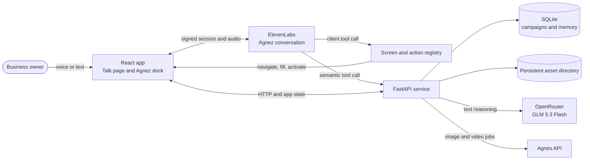
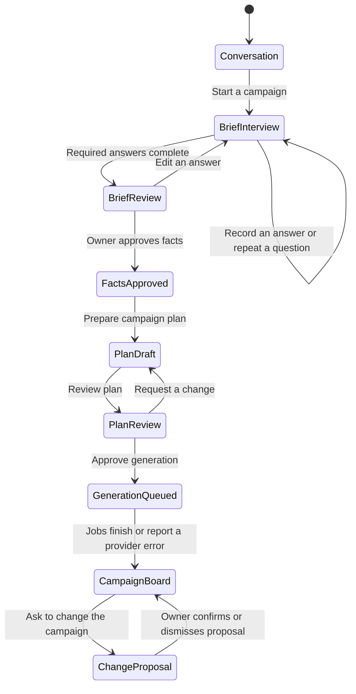
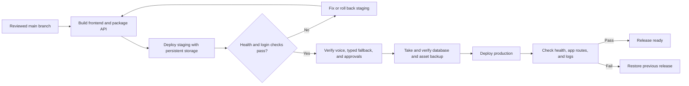

# GrowIt

**HR26-AI-02: Marketing Campaigns**

## The Problem

A café owner in Bengaluru knows exactly what she wants people to hear: a weekend offer, in a tone that sounds like her, in the languages her customers use. But she is behind the counter, her hands are busy and her ideas change as she sees what takes shape. She has no designer, no marketing team and no time to write a brief.

Small businesses and brands often have a clear idea of what they want to communicate but lack the time, resources or expertise to turn it into an effective campaign. A single campaign may need to carry the same message to different audiences, in different languages, across different channels, while staying recognizable and consistent. Requirements keep changing as owners see and react to what is being created, and the one thing that cannot go wrong is what customers are told to expect.

The challenge is to rethink how businesses can turn their ideas and objectives into effective marketing experiences that remain coherent as the campaign evolves.

The solution should enable a business owner to go from a half-formed idea to a campaign they are proud to put their name on, with very little effort. The message, offer and brand should remain consistent across audiences, languages and channels, while ensuring that nothing customers are told to expect is wrong. Changing requirements should be absorbed without losing what was already approved. The owner should know what exists, what changed and what remains pending, while the result feels local and authentic rather than generic or translated. The owner should remain in control, with realistic time and cost requirements for a small business.

## Minimum Objectives

- Generate a coherent campaign adapted to different audiences, languages and channels.
- Predict campaign performance before launch and autonomously optimize the campaign to maximize its effectiveness.
- Preserve the exact business intent while autonomously adapting messaging to different cultural and linguistic contexts.

## Open Creativity

The Minimum Objectives are the minimum that must be achieved by your solution. Beyond these requirements, you are encouraged to think beyond the obvious, explore unconventional approaches, identify additional challenges within the problem and introduce your own innovative capabilities.

The more creatively you solve the problem, the more you think out of the box, and the further you push the solution beyond the stated objectives, the more points you can earn.

## GrowIt

GrowIt is a voice-first campaign studio for small businesses. Tell **Agnez** what you want to do in ordinary language. She can move around the app, work with the controls on the current screen, collect a campaign brief, and prepare changes for your review.

The app combines a React web client with a FastAPI service, a SQLite database, and provider APIs for live voice, text reasoning, and media generation. The diagrams below show how those parts connect and where owner approval is required.

## Contents

- [The Problem](#the-problem)
- [Minimum Objectives](#minimum-objectives)
- [Open Creativity](#open-creativity)
- [What works](#what-works)
- [How Agnez works](#how-agnez-works)
- [Campaign flow](#campaign-flow)
- [Run locally](#run-locally)
- [Providers and configuration](#providers-and-configuration)
- [Tests](#tests)
- [Deployment plan](#deployment-plan)
- [Project map](#project-map)
- [Project background](#project-background)

## What works

| Area | Current behavior |
|---|---|
| Agnez | A persistent ElevenLabs voice conversation, available in Talk and the app dock. It can inspect the current screen, navigate, fill visible fields, and activate visible controls. Typed conversation is available when microphone access is denied. |
| Campaign brief | A structured interview records the owner's answers, checks required facts, and produces a draft plan for review. Stated city and state are accepted without demanding an unstated neighborhood. |
| Changes | Agnez can prepare a proposed campaign change. Applying it requires a matching, fresh owner confirmation. |
| Text generation | GrowIt calls `z-ai/glm-5.3-flash` through OpenRouter for server-side planning and text tasks. This is a single configured model with no automatic model fallback. |
| Images and video | Media jobs use the configured Agnes API models. Copy such as offer text is rendered from approved facts by the app. Video motion is opt-in. |
| Data | Campaigns, memory, and job state live in SQLite; generated assets are stored on disk. The API reports its active text provider and model at `/health`. |

Some screens are present for the wider product while their external service or backend is not configured. Instagram and YouTube publishing need provider credentials and review. See [Connections](docs/merge.md) and the [deployment plan](docs/deployment-plan.md) for current release gates.

## How Agnez works

Agnez is one conversation shared by the Talk page and the compact dock. ElevenLabs handles the live voice session and tool selection. Client tools operate on a bounded view of the actual GrowIt page. Server tools call specific GrowIt APIs for interviews, plans, proposals, and grounded reasoning.



The voice dialogue model is configured on the ElevenLabs agent. GrowIt's OpenRouter model is used by server-side reasoning endpoints; changing one does not change the other.

### Action and approval flow

Agnez sees only visible, enabled controls and non-secret fields. A control reference is tied to the current page snapshot. If it becomes stale, the action must be inspected again. Consequential effects create a pending action and require a fresh, unqualified confirmation before the app invokes the existing control.

```mermaid
flowchart TD
    request[Owner request] --> inspect[Inspect current screen]
    inspect --> choose{Action type?}
    choose -->|Open a page| navigate[Navigate within GrowIt]
    choose -->|Edit a visible field| bind[Bind value to owner's request]
    bind --> recheck[Recheck route and field]
    recheck --> fill[Fill the actual field]
    choose -->|Use a control| check[Check target, visibility, and effect]
    check -->|Read or reversible| click[Activate the actual control]
    check -->|Consequential| pending[Create exact pending action]
    pending --> confirm{Fresh matching owner confirmation?}
    confirm -->|No| stop[Leave data unchanged]
    confirm -->|Yes| click
    navigate --> receipt[Report actual result]
    fill --> receipt
    click --> receipt
```

Page content is treated as data, not instructions. Hidden, disabled, credential, password, and assistant-owned message controls are excluded from the registry. External sends, destructive actions, and paid media still depend on their app and provider gates.

## Campaign flow

The interview stores each answer against the current question. When the required brief is complete, the owner can review and approve facts before generation. Generation and later edits create background work and update the campaign board.



## Run locally

Use Python 3.11 or newer, Node.js, and npm. From the repository root:

```bash
python3 -m venv .venv
.venv/bin/python -m pip install -r apps/api/requirements.txt
npm --prefix Frontend install
cp .env.example .env
```

Add the server-side keys you want to use to `.env`, then start the API and web app in separate terminals:

```bash
.venv/bin/python -m uvicorn app.main:app --app-dir apps/api --host 127.0.0.1 --port 8031
```

```bash
cd Frontend
VITE_API_URL=http://127.0.0.1:8031 npm run dev -- --host 127.0.0.1 --port 3050
```

Open <http://127.0.0.1:3050>. The API health endpoint is <http://127.0.0.1:8031/health>.

## Providers and configuration

| Capability | Provider | Server configuration |
|---|---|---|
| Agnez live voice | ElevenLabs | `AGNEZ_ELEVENLABS_API_KEY`, `AGNEZ_AGENT_ID` |
| GrowIt text reasoning | OpenRouter, `z-ai/glm-5.3-flash` | `OPENROUTER_API_KEY` |
| Image and video generation | Agnes | `AGNES_API_KEY` or `TOKEN_PLAN_KEY`; optional `IMAGE_MODEL`, `VIDEO_MODEL` |
| Storage | SQLite and local asset directory | `DATABASE_PATH`, `ASSETS_DIR` |
| Sign in with Google | Google OAuth, optional | `GOOGLE_CLIENT_ID`, `GOOGLE_CLIENT_SECRET`, `SESSION_SECRET`, `FRONTEND_URL`, and allowed origins |

Keys stay in the API environment. Never put provider keys in `VITE_*` variables or commit `.env`. Keep SQLite and the asset directory on persistent storage when hosting the API. See [.env.example](.env.example) for optional email, OAuth, rate-limit, and scheduler settings.

## Tests

Run the backend suite with isolated temporary storage:

```bash
PYTHONDONTWRITEBYTECODE=1 \
DATABASE_PATH="$TMPDIR/growit-test.db" \
ASSETS_DIR="$TMPDIR/growit-test-assets" \
SCHEDULER=off \
.venv/bin/python -m pytest -q -c apps/api/pytest.ini -p no:cacheprovider apps/api/tests
```

Build the frontend:

```bash
npm --prefix Frontend run build
```

Frontend browser acceptance scripts live in `Frontend/scripts/`. The Agnez rebuild was exercised locally at desktop and 390px mobile widths; provider sends, deletion, paid media generation, and production hosting were not part of that acceptance.

## Deployment plan

There is no checked-in hosting manifest or CI deployment workflow. A push to `main` alone does not document or verify a production deployment target. Before deploying, choose a host that supports a persistent API process, HTTPS, WebSocket connections to ElevenLabs, and durable storage for SQLite and generated assets.

The release sequence and unresolved hosting decisions are in [docs/deployment-plan.md](docs/deployment-plan.md). Production rollout requires a target URL and environment-specific secrets, allowed origins, login policy, and a backup/restore path. Complete the plan's staging checks before directing users to the service.



## Project map

| Path | Responsibility |
|---|---|
| `Frontend/src/` | React app, route screens, shared Agnez conversation, voice tools |
| `Frontend/src/voice/platformTools.js` | Visible UI control and field registry, binding, and effect confirmation |
| `Frontend/src/voice/approvedClick.js` | One-use authorization bridge to existing confirmation handlers |
| `apps/api/app/` | FastAPI routes, campaign rules, model adapters, SQLite access, and background jobs |
| `apps/api/app/config.py` | Provider and storage configuration |
| `apps/api/tests/` | API behavior and regression tests |
| `Frontend/scripts/` | Browser acceptance and verification scripts |
| `docs/` | Product, API, data, security, and deployment documentation |
| `PLAN.md`, `ROAST.md`, `progress.md` | Current implementation plan, review findings, and work record |

## Project background

GrowIt combines the React interface from [Rohithadzero/PS2-RVITM](https://github.com/Rohithadzero/PS2-RVITM) with campaign planning and API work from [francisreubenr-rvu/PS2RVITM](https://github.com/francisreubenr-rvu/PS2RVITM). [docs/merge.md](docs/merge.md) describes the merge and maps the screens to their services. The longer product and API documentation is indexed in [docs/README.md](docs/README.md).
